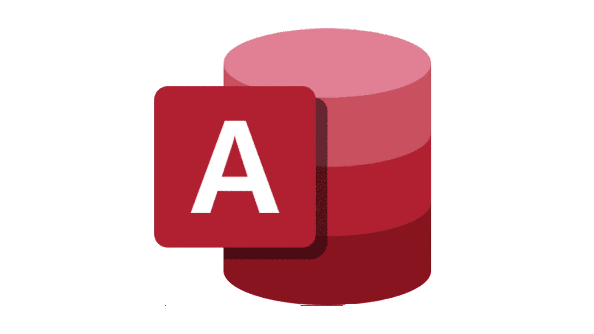

<h1 align="center">Hi 👋, I'm István Vizsy</h1>
<h3 align="center">A full-stack and really passionate logical board game developer from Hungary</h3>

- 💞️ I’m working on [Old rOOk.com](https://www.oldrook.com/), where you will be able to play online board games with pleasure.
  - :abacus: I use Alpha-Beta pruning and Boolean logic to optimize the computer's decision-making steps.
- 👀 I’m interested in FrontEnd (Sass CSS, Javascript), BackEnd (ASP.Net Core) and data-handling (MS-SQL, Python, Pandas, NumPy).
- 🌱 I’m currently learning **Blazor**.
- 📫 You can reach me: **istvan.vizsy1@gmail.com**

<h3 align="left">Connect with me:</h3>

### Languages:
| JavaScript | Sass-CSS | HTML | C# | SQL | Python | Visual Basic | 
|----------|----------|----------|----------|----------|----------|----------|
|  ||||||

### My frameworks and tools for Web development:

| ASP.NET Core | Bootstrap | VS Code | Visual Studio | npm | Blazor | Docker | Postman |
|----------|----------|----------|----------|----------|----------|----------|----------|
||||||||

### My tools and main libraries for Data Manipulation and Visualisation:

| Azure Data Studio | SSRS | MS Excel | MS Access | MS Power BI | Pandas | Numpy | Plotly | Matplotlib | VS Code |
|----------|----------|----------|----------|----------|----------|----------|----------|----------|----------|
||||||||||

  
### Environments, Testing, Other:

| AWS | Git | ChatGPT |
|----------|----------|----------|
|||

<!---
vizsyi/vizsyi is a ✨ special ✨ repository because its `README.md` (this file) appears on your GitHub profile.

  

&nbsp;

--->
